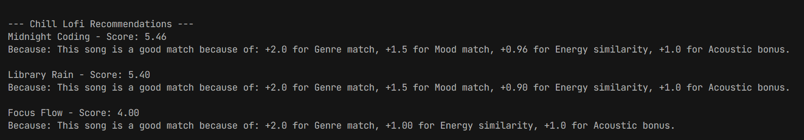
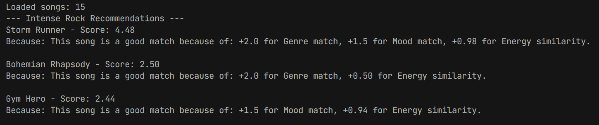
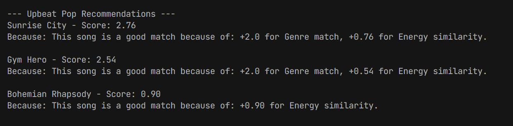
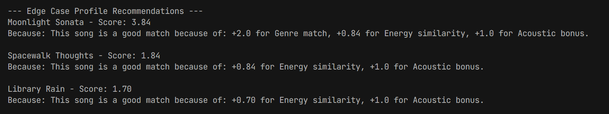
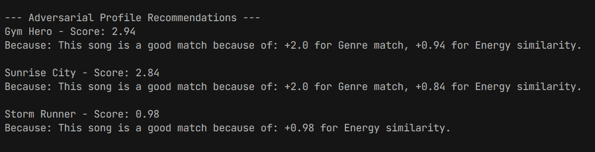

# 🎵 Music Recommender Simulation

## Project Summary

In this project you will build and explain a small music recommender system.

Your goal is to:

- Represent songs and a user "taste profile" as data
- Design a scoring rule that turns that data into recommendations
- Evaluate what your system gets right and wrong
- Reflect on how this mirrors real world AI recommenders

Replace this paragraph with your own summary of what your version does.

---

## How The System Works

While spotify and other music recommendations apps have complex algorithms that attempt to predict the next song the user would enjoy, our algorithm is a bit less complex. Primarily we will be focusing on factors involving mood, genre, and energy to match user with songs.

The approach we use is point based where we consider mood, genere, and energy level to score each song. The algorithm recipe goes as follow; if genre matches it gets 2 points, if energy matches it gets up to one point and if acoustic matches score gets extra one point bump. 

Biases 
There is potential for bias for genre since it is assigned more weight. This opens the floor for users to get stuck in a particular genre like country.

## Design
Explain your design in plain language.

Some prompts to answer:

- What features does each `Song` use in your system
  - id,title,artist,genre,mood,energy,tempo_bpm,valence,danceability,acousticness
- What information does your `UserProfile` store
  - favorite_genre, favorite_mood,target_energy,likes_acoustic=False,
- How does your `Recommender` compute a score for each song
 - genre, mood, and energy
- How do you choose which songs to recommend
  - genre and mood likeliness to userprofile

You can include a simple diagram or bullet list if helpful.

---

## Getting Started

### Setup

1. Create a virtual environment (optional but recommended):

   ```bash
   python -m venv .venv
   source .venv/bin/activate      # Mac or Linux
   .venv\Scripts\activate         # Windows

2. Install dependencies

```bash
pip install -r requirements.txt
```

3. Run the app:

```bash
python -m src.main
```

### Running Tests

Run the starter tests with:

```bash
pytest
```

You can add more tests in `tests/test_recommender.py`.

---

## Experiments You Tried

Use this section to document the experiments you ran. For example:

- What happened when you changed the weight on genre from 2.0 to 0.5
The model currently overfits genre since it has high weight of 2.0 and lowering it would balance the fitting.
- What happened when you added tempo or valence to the score
The model does not use tempo or valence to the socre
- How did your system behave for different types of users
It worked best for lofi and pop preferenced users since there were more songs that fit those categories
---

## Limitations and Risks

Summarize some limitations of your recommender.

Examples:

- The model favors more represented fields such as genre of pop as it is the most frequently occuring in csv
- It does not review lyrics or language
- Huge recommenders have millions of songs, but the dataset is relatively small.

You will go deeper on this in your model card.

---

## Reflection

Read and complete `model_card.md`:

[**Model Card**](model_card.md)

Write 1 to 2 paragraphs here about what you learned:

- I learned that recommendation systems work on a scoring scale. The final score or sum total of all assigned points determines the recommendation. I would guess more complex algorithms work similiar using vectors and various factors like lyrics. Finally, the reasoning also helps users and developers understand the logic.


---

## 7. `model_card_template.md`

Combines reflection and model card framing from the Module 3 guidance. :contentReference[oaicite:2]{index=2}  

# 🎧 Model Card - Music Recommender Simulation

## 1. Model Name

Give your recommender a name, for example:

> VibeFinder 1.0

---

## 2. Intended Use

- The system is intended for music listeners. The system is attempting to recommend the top songs that match user preferences.

Example:

> This model suggests 3 to 5 songs from a small catalog based on a user's preferred genre, mood, and energy level. It is for classroom exploration only, not for real users.

---

## 3. How It Works (Short Explanation)

Describe your scoring logic in plain language.

- What features of each song does it consider
- What information about the user does it use
- How does it turn those into a number

Try to avoid code in this section, treat it like an explanation to a non programmer.

---

## 4. Data

Describe your dataset.

- How many songs are in `data/songs.csv`
40 songs
- Did you add or remove any songs
No songs removed
- What kinds of genres or moods are represented
Not all generes or mood represented as classical and rap where missing.
- Whose taste does this data mostly reflect
This data mostly reflects taste for mainstream lofi and pop

---

## 5. Strengths

Where does your recommender work well

You can think about:
- The recommender works well on direct user matches
- The recommender works best with user profiles that are detailed and well-defined

---

## 6. Limitations and Bias

Where does your recommender struggle

Some prompts:
- Recommender struggles with overfiting for gnere since it is assigned more weight
- Recommender struggles since song dataset are more limited.
- It is biased towards lofi and pop since its the majority of the dataset

---

## 7. Evaluation

How did you check your system

Examples:
- I tried multiple user profiles and even a few edge and adversarial cases.


You do not need a numeric metric, but if you used one, explain what it measures.

---

## 8. Future Work

If you had more time, how would you improve this recommender

Examples:

- I would have added more dynamic scoring logic such as penalties for repeated songs
- I would use more factors such as language and lyrics as a larger factor in the recommender

---

## 9. Personal Reflection

A few sentences about what you learned:

- What surprised you about how your system behaved
I was suprised that AI made greta recommendations such as a do not play recommendation for disliked songs
- How did building this change how you think about real music recommenders
This makes the recommendation system more accurate to match user preferences
- Where do you think human judgment still matters, even if the model seems "smart"
Human judgement is important for noticing edge cases. For example, some users may believe lyrics are too vulgar or unrelatable.

## Screenshots

### Chill Lo-fi


### Intense Rock


### Upbeat Pop


### Edge Case


### Adversarial
